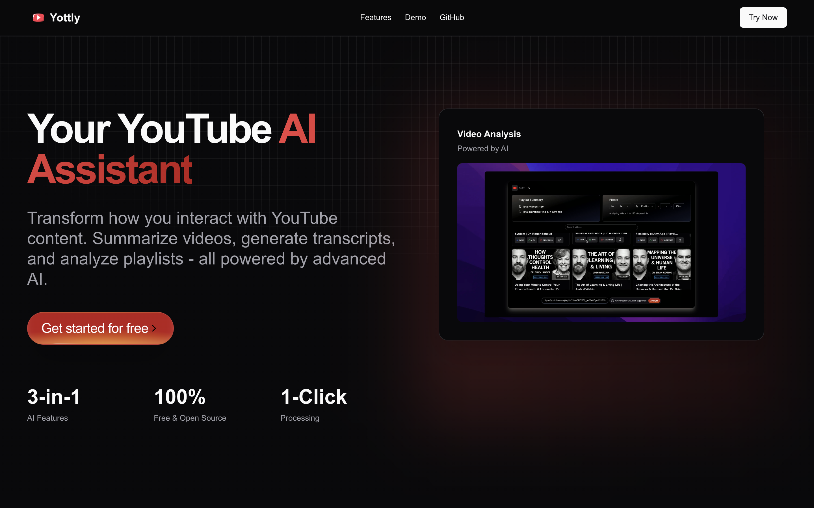

# Yottly

**GenAI AI-Powered YouTube Playlist & Video Analyzer**

Yottly is a **free and open-source** SaaS app that enhances YouTube content analysis using Generative AI. It offers powerful playlist filtering, transcript generation, multilingual translation, AI-based video summarization and Quiz Generator



## Features

### Playlist Analyzer

- Analyze YouTube playlists with **custom filters**:
  - **Playback speed**
  - **Sort by**: Duration, Likes, Views
  - **Search within playlist**
- Get the **total duration** of the playlist after applying filters.

### Transcript Generator

- Generate **transcripts with timestamps** for any YouTube video.
- **Download** transcripts in **TXT** and **SRT** formats.
- **Search within transcript** for specific keywords.
- **Multilingual translation** via **Google Translate API** _(temporarily unavailable due to high traffic)_.

### AI-Powered Video Summarizer

- Summarize YouTube videos using **state-of-the-art AI models**:
  - Deepseek R1 Distilled
  - Llama 3-70B
  - Gemma-2B
  - Gemini 2.0
  - Mixtral-8x7B

### Integrated Quiz Portal

* Auto-generate interactive quizzes based on the video content.
* Great for **learning and self-assessment**.

### Channel Stats

* View key stats for any YouTube channel:

  * Subscriber count
  * Total views
  * Average video length
  * Estimated Revenue

## Tech Stack

* [Next.js](https://nextjs.org/)
* [TypeScript](https://www.typescriptlang.org/)
* [Shadcn](https://ui.shadcn.com/)
* [Vercel AI SDK](https://sdk.vercel.ai/)
* [Google YouTube v3 API](https://developers.google.com/youtube/v3)
* [Google Translate API](https://cloud.google.com/translate) *(temporarily unavailable due to high traffic)*
* [Groq Cloud](https://groq.com/)
* [Docker](https://www.docker.com/)
* [Upstash Redis](https://upstash.com/)


## 🚀 Get Started

1. **Clone the repository**
   ```sh
   git clone https://github.com/abhisek-1221/yottly.git
   cd yottly
   ```
2. **Install dependencies**
   ```sh
   npm install
   ```
3. **Run the app**
   ```sh
   npm run dev
   ```
4. **Open in browser**
   ```
   http://localhost:3000
   ```

### Using Docker

Alternatively, you can run the application using Docker. You'll need a `.env.local` file in the project root containing your necessary API keys (e.g., `GOOGLE_API_KEY`, `GROQ_API_KEY`, `UPSTASH_REDIS_REST_URL`, `UPSTASH_REDIS_REST_TOKEN`).

1.  **Build the Docker image:**
    ```sh
    docker build -t yottly .
    ```
2.  **Run the container:**
    ```sh
    # Ensure .env.local exists in the current directory
    docker run -p 3000:3000 --env-file .env.local yottly
    ```
    - _Note: Some features might require specific API keys in your `.env.local` file._

### Using Docker Compose

You can also use Docker Compose for easier management (recommended). Ensure you have a `.env.local` file as described above.

1.  **Start the services:**
    ```sh
    docker-compose up -d
    ```
2.  **Stop the services:**
    ```sh
    docker-compose down
    ```

## Contribute

Yottly is **open-source**! We welcome contributions to improve features, fix bugs, and enhance performance.

1. Fork the repo
2. Create a feature branch (`git checkout -b feature-name`)
3. Commit changes (`git commit -m "Add new feature"`)
4. Push to branch (`git push origin feature-name`)
5. Open a Pull Request

## Star the Repo

If you find **Yottly** useful, don't forget to **star ⭐ the repository** on GitHub!

---
